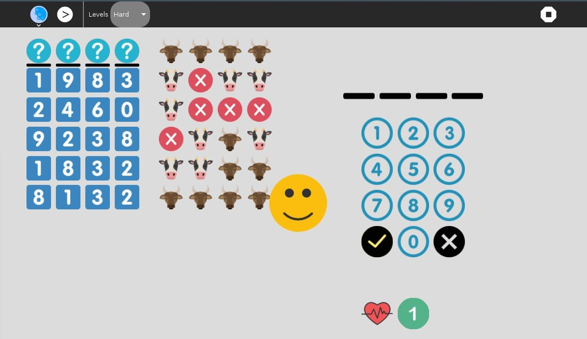
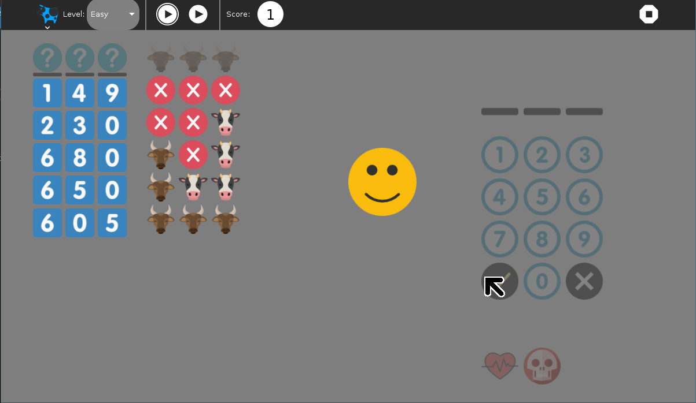

# CowBulls Activity
Sugar Activity of the classic "CowBulls" game, with a slight twist ;)

### About:
 - This is a [sugar](https://sugarlabs.org/) activity
 - For instructions on how to play, see [here](INSTRUCTIONS.md)
 - This game has 3 levels
   - Easy (3 digits, 5 lives)
   - Medium (4 digits, 5 lives)
   - Hard (5 digits, 6 lives)
 - Bull overrides cow.
   - Eg: If the correct number is 4864 and you enter 7104, you will get a bull at the last position, and no cow anywhere
 - Correct answer is displayed in case you lose
 - Game can be restarted at any point of time.
 - Your score increases by the number of lives you have + 1

### Development:
 - **Issue/Suggesstion:** If you find an issue or have any suggestions for improvements, please open an issue in the bug tracker.
 - **Contribute:** Contributions(feature/bug-fix) are welcomed. Kindly open a pull request.

### Further Improvements:
 - Option for a two-player shared activity, where one user chooses a number and the other guesses it.
   [In priority]
 - Can have numbers coming up until the player loses (A scoring based system, which also saves the high score)
   [Implemented in fd2a792]
 - Should have descriptive text at some places in the activity(Depends on initial response of testing)
   [No, as of now]

### Notes:
 - Uses [sugargame](https://github.com/sugarlabs/sugargame) v1.2
 - Adjusts itself to the screen size

### Known Bugs:
 - Numpad keys 3, 5 and 0 aren't detected. 
   Log: `Key KP_Next unrecognised`

### Credits:
 - Thanks to @walterbender, @Hrishi for guiding via irc
 - Icons borrowed from multiple authors via [FlatIcon](https://www.flaticon.com)

### Screenshots:
 - Round in progress (Level: Easy)
 
 - Round won (Level: Easy)
 
